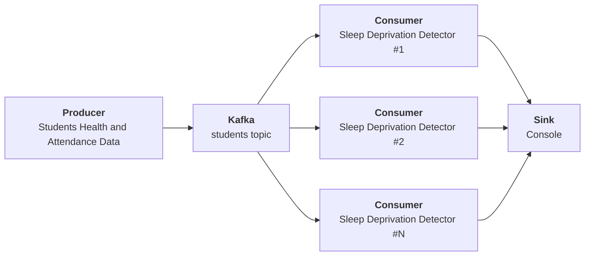

# DFA

## Build & Run

```sh
docker compose build
docker compose up
```

## Pipeline



## Measurements

sync producer, 20 partitions:

* producer=9.715808858s
* consumer=207.058462ms

sync producer, 10 partitions:

* producer=10.025242598s
* consumer=353.644183ms

sync producer, 5 partitions:

* producer=9.927862036s
* consumer=202.744433ms

sync producer, 2 partitions:

* producer=9.191151496s
* consumer=219.251645ms
